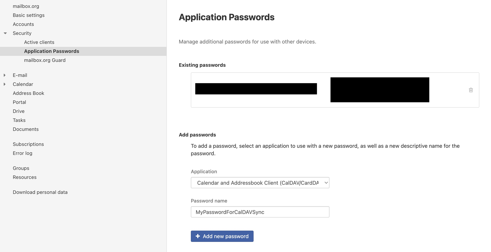

[paypal]: https://paypal.me/GerdNaschenweng

# 📅 calendar-sync


[](https://github.com/magicdude4eva/calendar-sync/commits/master)


> Sync ICS (.ics) feeds (e.g. Müllabfuhr, Feiertage, F1) to your 📆 CalDAV calendar (e.g. mailbox.org) with emoji support, deduplication, Docker, yearly recurring events, and more.

<video src="https://github.com/user-attachments/assets/59d1b6f4-32ad-4133-8826-021ca2ea3030" autoplay muted loop></video>

---


___

🍺 **Please support me**: Although all my software is free, it is always appreciated if you can support my efforts on Github with a [contribution via Paypal][paypal] - this allows me to write cool projects like this in my personal time and hopefully help you or your business. 

<video src="https://github.com/user-attachments/assets/59d1b6f4-32ad-4133-8826-021ca2ea3030" autoplay muted loop></video>


___

🍺 **Please support me**: Although all my software is free, it is always appreciated if you can support my efforts on Github with a [contribution via Paypal][paypal] - this allows me to write cool projects like this in my personal time and hopefully help you or your business. 

---

## ✨ Features

- 🔁 Sync multiple ICS feeds to any CalDAV calendar
- 🧠 Deterministic UID generation & deduplication
- 🔁 Automatic expansion of YEARLY recurring events
- 📍 Location-based filtering for region-specific holidays
- 🧹 Optional cleanup of old imported events
- 📅 Supports emoji mapping for event names
- 🛑 Dry run mode to test before writing
- 🐳 Docker support for simple deployment

---

## 🚀 Usage

### Manual

```bash
python src/calendar_sync.py --import
python src/calendar_sync.py --import --dry-run
python src/calendar_sync.py --cleanup
```

### With Docker Compose

First, build the container:

```bash
docker-compose build
```

Then run the sync:

```bash
docker-compose run --rm calendar-sync --import
docker-compose run --rm calendar-sync --import --dry-run
docker-compose run --rm calendar-sync --cleanup
```

---

## 🧰 Manual Installation

```bash
git clone https://github.com/magicdude4eva/calendar-sync.git
cd calendar-sync
python3.13 -m venv .venv
source .venv/bin/activate
pip install -r requirements.txt
```

---

## ⚙️ config.json

```json
{
  "caldav_url": "https://dav-sso.mailbox.org/caldav/...",
  "username": "your@email.com",
  "password": "your-app-password",
  "timezone": "Europe/Vienna",
  "uid_prefix": "ICS-",
  "future_event_limit_days": 365,
  "ics_feeds": [
    {
      "url": "https://example.com/my.ics",
      "emoji_mapping": {
        "Papier": "♻️",
        "default": "📦"
      }
    }
  ]
}
```

---

## 🛠️ How It Works

- Fetches events from each configured ICS feed
- Normalizes dates and checks if the UID exists
- Skips, adds, or replaces events as needed
- Uses emoji mappings to prefix event names
- All-day events are handled properly (no time zone shift)
- Recurring `RRULE:FREQ=YEARLY` events are expanded into individual years
- Events can be filtered by `LOCATION` using `import_locations`

🗺️ For `import_locations`, configure it per feed. For example:

```json
{
  "url": "https://www.feiertage-oesterreich.at/kalender-download/ics/feiertage-oesterreich.ics",
  "import_locations": "K,St,V",
  "emoji_mapping": {
    "§": "🇦🇹",
    "default": "🗓️"
  }
}
```

To discover valid locations, run the sync once and check the logs. Example:
```
INFO: ⏭️ Skipping 'St. Florian' (2025-05-04) due to unmatched location: OÖ
```


---

## 🧪 Dry Run

Add `--dry-run` to see what would happen without making changes:

```bash
docker-compose run --rm calendar-sync --import --dry-run
```

---

## 🗂️ Project Structure

```
calendar-sync/
├── src/
│   ├── calendar_sync.py      # Entry script
│   └── utils.py              # Core sync logic
├── config.json               # Configuration
├── Dockerfile
├── docker-compose.yml
├── requirements.txt
└── README.md
```

---

## 📷 mailbox.org Setup Guide

### 1. 🔐 Create Application Password  
Go to `Settings → Security → Application Passwords`  
Select **Calendar and Addressbook Client (CalDAV/CardDAV)**  


---

### 2. 📅 Create a New Calendar  
Go to the **Calendar** section → click `+ Add new calendar`  


---

### 3. 🔗 Get the CalDAV URL  
Right-click your new calendar → `Properties` → Copy the URL  


Paste it into `config.json` under `"caldav_url"`

---

## 📄 License

This project is licensed under the [MIT License](LICENSE).

---

## ❤️ Contributing

PRs welcome! File issues or ideas via GitHub.

## Donations are always welcome
[paypal]: https://paypal.me/GerdNaschenweng
:beer: **Please support me**: Although all my software is free, it is always appreciated if you can support my efforts on Github with a [contribution via Paypal][paypal] - this allows me to write cool projects like this in my personal time and hopefully help you or your business. 
```
(CRO)    0xBAdB43af444055c4031B79a76F74895469BA0CD7 (Cronos)
(USDC)   0xBAdB43af444055c4031B79a76F74895469BA0CD7
(ETH)    0xfc316ba7d8dc325250f1adfafafc320ad75d87c0
(BTC)    1Mhq9SY6DzPhs7PNDx7idXFDWsGtyn7GWM
(BNB)    0xfc316ba7d8dc325250f1adfafafc320ad75d87c0
Crypto.com PayString: magicdude$paystring.crypto.com    
```

Go to [Curve.com to add your Crypto.com card to ApplePay](https://www.curve.com/join#DWPXKG6E) and signup to [Crypto.com for a staking and free Crypto debit card](https://crypto.com/app/ref6ayzqvp).

Use [Binance Exchange](https://accounts.binance.com/register?ref=13896895) to trade #altcoins. I also accept old-school **[PayPal](https://paypal.me/GerdNaschenweng)**.

