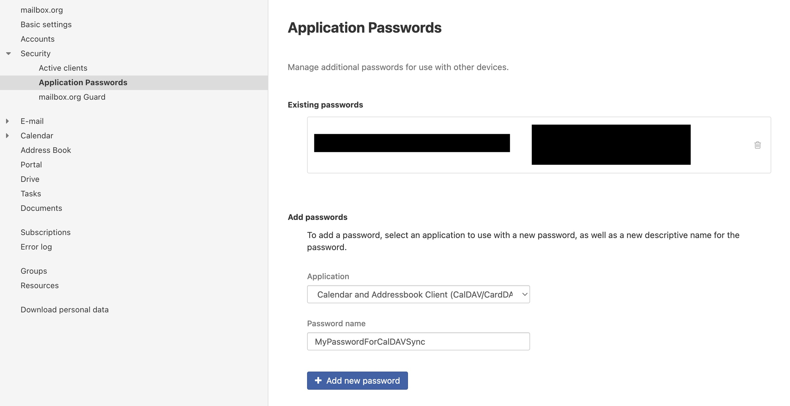
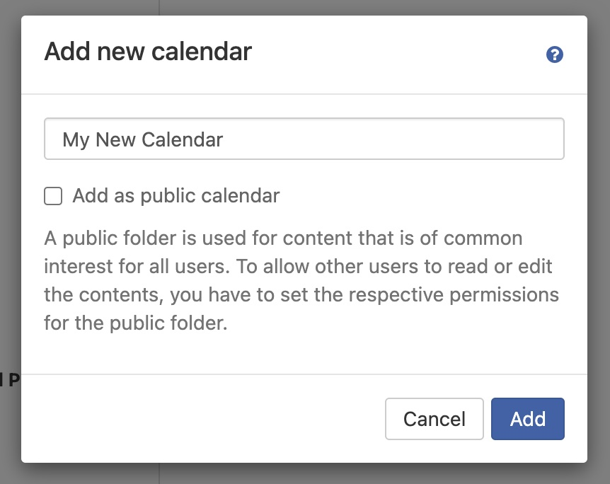
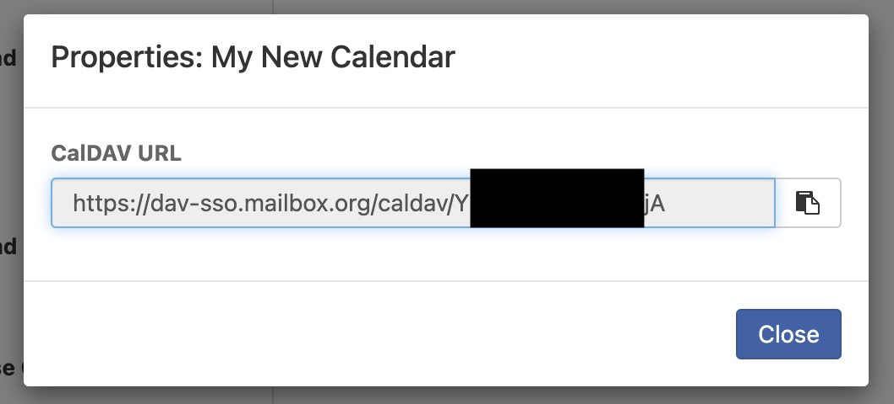

[paypal]: https://paypal.me/GerdNaschenweng

# 📅 calendar-sync


[](https://github.com/magicdude4eva/calendar-sync/commits/master)


`calendar-sync` is a flexible utility to sync one or more ICS feeds (iCalendar) into a CalDAV-compatible calendar — ideal for mailbox.org, Nextcloud, Synology, and more.

It supports features such as:
- ✅ Deterministic UID generation for clean deduplication
- 📅 Emoji mapping for more readable calendar events
- 🔁 Automatic expansion of `RRULE:FREQ=YEARLY` events
- 🔁 Full support for recurring events (e.g., yearly holidays) and custom extra events (Mother's Day, Advent Sundays, etc.)
- 🧼 Cleanup mode with multi-prefix support (`--cleanup PREFIX1,PREFIX2`)
- 📍 Location-based filtering (e.g., for regional holidays in Austria)
- 🐳 Docker deployment for simple automation
- 💡 Dry-run mode to preview changes without writing
- 🕓 Timezone-aware handling for accurate scheduling

This is perfect for importing:
- 🗑️ Municipal waste collection schedules (e.g., Müll App)
- 🇦🇹 Austrian public holidays
- 🏎️ Formula 1 calendar with free practice, qualifying, and GP events

Unlike subscription-based ICS calendars, this tool **writes events directly into your calendar**, giving you full control over notifications, offline visibility, and data retention.

Use it on your Synology NAS, a server, or as a cron-triggered Docker container — and never miss a bin collection or Grand Prix again.


<video src="https://github.com/user-attachments/assets/59d1b6f4-32ad-4133-8826-021ca2ea3030" autoplay muted loop></video>

---


___

🍺 **Please support me**: Although all my software is free, it is always appreciated if you can support my efforts on Github with a [contribution via Paypal][paypal] - this allows me to write cool projects like this in my personal time and hopefully help you or your business. 


---

## ✨ Features

- 🔁 Sync multiple ICS feeds to any CalDAV calendar
- 🧠 Deterministic UID generation & deduplication
- 🔁 Automatic expansion of YEARLY recurring events
- 📍 Location-based filtering for region-specific holidays
- 🧹 Optional cleanup of old imported events
- 📅 Supports emoji mapping for event names
- 🛑 Dry run mode to test before writing
- 🐳 Docker support for simple deployment

---

## 🚀 Usage

### Manual

```bash
# Default config file (config.json)
python src/calendar_sync.py --import
python src/calendar_sync.py --import --dry-run
python src/calendar_sync.py --cleanup # cleans global prefix
python src/calendar_sync.py --cleanup MUELL-,F1- # cleans multiple prefixes

# Custom config file
python src/calendar_sync.py --import --config /path/to/another_config.json
python src/calendar_sync.py --import --dry-run --config /path/to/another_config.json
python src/calendar_sync.py --cleanup --config /path/to/another_config.json
```

### With Docker Compose

First, build the container:

```bash
docker-compose build
```

Then run the sync:

```bash
# Default config file
docker-compose run --rm calendar-sync --import
docker-compose run --rm calendar-sync --import --dry-run
docker-compose run --rm calendar-sync --cleanup

# Custom config file (mount the config file into the container)
docker-compose run --rm -v /path/to/another_config.json:/app/config.json calendar-sync --import
docker-compose run --rm -v /path/to/another_config.json:/app/config.json calendar-sync --import --dry-run
docker-compose run --rm -v /path/to/another_config.json:/app/config.json calendar-sync --cleanup
```

---

## 🧰 Manual Installation

```bash
git clone https://github.com/magicdude4eva/calendar-sync.git
cd calendar-sync
python3.13 -m venv .venv
source .venv/bin/activate
pip install -r requirements.txt
```

---

## ⚙️ Configuration

You can use multiple config files to manage different calendars. By default, the script uses `config.json`. To use a different config file, pass it via the `--config` argument:

```bash
python src/calendar_sync.py --import --config /path/to/another_config.json
```

Example config:
```json
{
  "caldav_url": "https://dav-sso.mailbox.org/caldav/...",
  "username": "your@email.com",
  "password": "your-app-password",
  "timezone": "Europe/Vienna",
  "uid_prefix": "ICS-",
  "future_event_limit_days": 365,
  "ics_feeds": [
    {
      "url": "https://example.com/my.ics",
      "uid_prefix": "EXAMPLE-",
      "emoji_mapping": {
        "Papier": "♻️",
        "default": "📦"
      },
      "default_reminder": "1d"
    }
  ]
}
```

---

## 🛠️ How It Works

- Fetches events from each configured ICS feed
- Normalizes dates and checks if the UID exists
- Skips, adds, or replaces events as needed
- Uses emoji mappings to prefix event names
- All-day events are handled properly (no time zone shift)
- Recurring `RRULE:FREQ=YEARLY` events are expanded into individual years
- Events can be filtered by `LOCATION` using `import_locations`

🗺️ For `import_locations`, configure it per feed. For example:

```json
{
  "url": "https://www.feiertage-oesterreich.at/kalender-download/ics/feiertage-oesterreich.ics",
  "import_locations": "K,St,V",
  "emoji_mapping": {
    "§": "🇦🇹",
    "default": "🗓️"
  }
}
```

To discover valid locations, run the sync once and check the logs. Example:
```
INFO: ⏭️ Skipping 'St. Florian' (2025-05-04) due to unmatched location: OÖ
```

### 📱 Emoji Mapping

Emoji mapping allows you to prefix event titles with emojis for better visual organization in your calendar. This is particularly useful when syncing multiple ICS feeds to distinguish between different event types at a glance.

**How it works:**

The `emoji_mapping` object in your feed configuration uses **event title matching** to determine which emoji to prepend to an event:

1. **Exact key matching**: The script checks if any key in the `emoji_mapping` object matches part of the event's title
2. **Prepending**: When a match is found, the corresponding emoji is prepended to the event title
3. **Fallback**: If the event title doesn't match any configured keys, the `"default"` emoji is used
4. **Case-sensitive**: Matching is case-sensitive

**Key points:**

- The `emoji_mapping` object accepts any string as a key (words, phrases, special characters, etc.)
- The `"default"` key is a special reserved field that serves as a fallback emoji when no other keys match
- Values must be emojis or text that will be prepended to the event title
- You can configure multiple mappings per feed

**Examples:**

```json
{
  "url": "https://example.com/waste.ics",
  "emoji_mapping": {
    "Papier": "♻️",
    "Plastik": "🟡",
    "Glas": "🟢",
    "Restmüll": "⚫",
    "default": "🗑️"
  }
}
```

With the above configuration, an event titled "Papier Collection" would become "♻️ Papier Collection", while an unknown event type would become "🗑️ Unknown Event".

**Another example (Austrian holidays):**

```json
{
  "url": "https://www.feiertage-oesterreich.at/kalender-download/ics/feiertage-oesterreich.ics",
  "emoji_mapping": {
    "Ostern": "🐰",
    "Weihnachten": "🎄",
    "Neujahr": "🎆",
    "§": "🇦🇹",
    "default": "🗓️"
  }
}
```

### ⏰ Default Reminder Format

The `default_reminder` field specifies when you should receive a notification for imported events. It uses a duration format with unit suffixes:

| Format  | Meaning |
|---------|---------|
| `15m`   | 15 minutes before the event |
| `1h`    | 1 hour before the event |
| `1d`    | 1 day before the event |
| `2d`    | 2 days before the event |
| `1w`    | 1 week before the event |

- **`m`** = minutes
- **`h`** = hours
- **`d`** = days
- **`w`** = weeks

**Examples:**

```json
{
  "ics_feeds": [
    {
      "url": "https://example.com/my.ics",
      "default_reminder": "15m"   // Notify 15 minutes before
    },
    {
      "url": "https://example.com/holidays.ics",
      "default_reminder": "1d"    // Notify 1 day before
    },
    {
      "url": "https://example.com/formula1.ics",
      "default_reminder": "2h"    // Notify 2 hours before
    }
  ]
}
```

### 🗓️ Support for Yearly Recurring Events (`RRULE:FREQ=YEARLY`)
The script automatically expands ICS events with `RRULE:FREQ=YEARLY` rules into individual event instances for each year, up to the configured future limit (`future_event_limit_days`). This ensures recurring events like public holidays or anniversaries are correctly synced across multiple years.

**Behavior:**
- Detects yearly recurring events by scanning raw `RRULE` data.
- Expands the base event for each year (e.g. from 2025 to 2026).
- Skips events in the past or beyond the future limit.
- Deduplicates intelligently using UID hashing per year.

### ➕ Support for Custom Extra Events
In addition to ICS feeds, you can define your own custom events using the `extra_events` entry in `config.json`.

This allows you to add things like:

- 🌷 Mother's Day (2nd Sunday of May)
- 👨‍👧‍👦 Father's Day (2nd Sunday of June)
- 🔥 Summer Solstice (21st June)
- 🎃 Halloween (31st October)
- 🕯️ Advent Sundays
- 🧾 Tax Deadlines
- ☀️ Daylight Saving Time changes

**Supported Formats:**

| Format                     | Description                                 | Example                   |
|----------------------------|---------------------------------------------|---------------------------|
| `N.Weekday.Month`          | Nth weekday of a month                      | `2.Sunday.5` → 2nd Sunday in May |
| `-N.Weekday.Month`         | Nth weekday from end of month               | `-1.Sunday.3` → last Sunday in March |
| `DD.MM.fixed`              | Fixed date                                  | `31.10.fixed` → 31st October     |

**Sample:**

```json
    "extra_events": [
      "☀️ Sommerzeit beginnt:-1.Sunday.3",
      "🌷 Muttertag:2.Sunday.5",
      "👨‍👧‍👦 Vatertag:2.Sunday.6",
      "🔥 Sonnwendfeier:21.6.fixed",
      "🧾 Steuererklärung:30.6.fixed",
      "🌒 Sommerzeit endet:-1.Sunday.10",
      "🎃 Halloween:31.10.fixed",
      "🕯️ 1. Advent:-4.Sunday.12",
      "🕯️ 2. Advent:-3.Sunday.12",
      "🕯️ 3. Advent:-2.Sunday.12",
      "🕯️ 4. Advent:-1.Sunday.12",
      "👹 Krampusnacht:5.12.fixed",
      "🎅 Nikolaus:6.12.fixed"    
      ],
```

---

## 🧪 Dry Run

Add `--dry-run` to see what would happen without making changes:

```bash
docker-compose run --rm calendar-sync --import --dry-run
```

---

## 🗂️ Project Structure

```
calendar-sync/
├── src/
│   ├── calendar_sync.py      # Entry script
│   └── utils.py              # Core sync logic
├── config.json               # Configuration
├── Dockerfile
├── docker-compose.yml
├── requirements.txt
└── README.md
```

---

## 📷 mailbox.org Setup Guide

### 1. 🔐 Create Application Password  
Go to `Settings → Security → Application Passwords`  
Select **Calendar and Addressbook Client (CalDAV/CardDAV)**  


---

### 2. 📅 Create a New Calendar  
Go to the **Calendar** section → click `+ Add new calendar`  


---

### 3. 🔗 Get the CalDAV URL  
Right-click your new calendar → `Properties` → Copy the URL  


Paste it into `config.json` under `"caldav_url"`
---

## 📄 License
This project is licensed under the [MIT License](LICENSE).

---

## ❤️ Contributing
PRs welcome! File issues or ideas via GitHub.

## Donations are always welcome

[paypal]: https://paypal.me/GerdNaschenweng

🍻 **Support my work**  
All my software is free and built in my personal time. If it helps you or your business, please consider a small donation via [PayPal][paypal] — it keeps the coffee ☕ and ideas flowing!

💸 **Crypto Donations**  
You can also send crypto to one of the addresses below:

```
(BTC)   bc1qdgdkk7l98pje8ny9u4xavsvrea8dw6yu8jpnyf
(ETH)   0x5986f713A538D6bCaC0865564dCD45E2600A3469  
(POL)   0x5986f713A538D6bCaC0865564dCD45E2600A3469
(CRO)   0xb83c3Fe378F5224fAdD7a0f8a7dD33a6C96C422C (Cronos or Crypto.com Paystring magicdude$paystring.crypto.com)
(BNB)   0x5986f713A538D6bCaC0865564dCD45E2600A3469
(LTC)   ltc1qexst2exxksfyg7erfzlfrm23twkjgf7e5fn64t
(DOGE)  DMQsxc9XGF6526drBJDZeX7AjFDJsEz4mN
(SOL)   t4bYQCUuoCUrp7kJ4Mz314npcTuKoUSXj28UgdMrfTb
```

🧾 **Recommended Platforms**  
- 👉 [Curve.com](https://www.curve.com/join#DWPXKG6E): Add your Crypto.com card to Apple Pay  
- 🔐 [Crypto.com](https://crypto.com/app/ref6ayzqvp): Stake and get your free Crypto Visa card  
- 📈 [Binance](https://accounts.binance.com/register?ref=13896895): Trade altcoins easily
